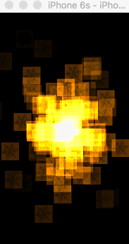

# FireWorks

####视图效果

####核心代码
    CAEmitterCell *cell = [[CAEmitterCell alloc] init];
    cell.contents = (__bridge id)[UIImage imageNamed:@"1.png"].CGImage;
    cell.birthRate = 50.0;
    cell.lifetime = 5;
    cell.color = [UIColor colorWithRed:1 green:0.5 blue:0.1 alpha:1].CGColor;
    cell.alphaSpeed = -0.4;
    cell.velocity = 100;
    cell.velocityRange = 50;
    cell.emissionRange = M_PI*6;
    emitter.emitterCells = @[cell];
####[CSaT_Sun_Tony](http://weibo.com/5499355621/profile?rightmod=1&wvr=6&mod=personinfo)